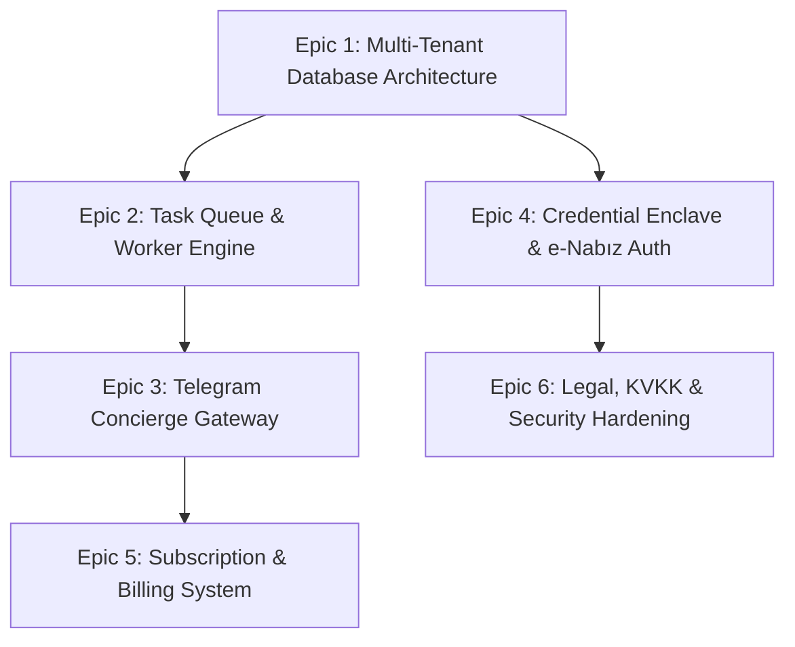

# 🏥 Hosted Subscription Service (Managed e-Nabız AI) — Architecture & Backlog

> [!IMPORTANT]
> **Status:** Future Planning & Architectural Backlog (Not currently implemented).  
> **Target Scale:** Strictly capped at **50 subscribers maximum** (VIP / Family Concierge scale).  
> **Core Objective:** Provide automated weekly e-Nabız health intelligence to non-technical users without requiring them to run Python, Ollama, Playwright, or terminal commands.

---

## 1. Product & Service Model

### 1.1 The "No-Code" User Experience
Non-technical users cannot and should not be expected to manage Git repos, local vision models, or terminal CLI commands. The hosted model delivers the service entirely through **Telegram** (and optionally an ultra-minimal mobile-friendly web portal):

1. **Onboarding:** Subscriber receives an invite code, opens the private Telegram Bot (`@ENabizAIBot`), enters their activation code.
2. **One-Time Authentication:**
   - Bot prompts for TC No and **direct e-Nabız password** (strongly preferred over e-Devlet password to isolate medical access from broader government identity).
   - If 2FA SMS arrives, subscriber types the 6-digit code into Telegram.
   - Server validates session and destroys plaintext passwords from memory.
3. **Weekly Delivery:** Every Sunday evening, the subscriber receives an executive AI-synthesized clinical summary on Telegram:
   - Abnormal biomarker alerts & trends.
   - Longitudinal comparisons against tests from previous years.
   - Doctor consultation talking points for upcoming appointments.
4. **Interactive Q&A:** Subscriber can text the bot anytime: *"What was my last fasting glucose?"* or *"Show my cholesterol progression over the past 3 years"*.

### 1.2 Subscription & Pricing Concept (50-Seat Hard Cap)

| Tier | Capacity | Scope | Target Pricing |
|---|:---:|---|:---:|
| **Individual VIP** | 35 seats | 1 Person (Weekly sync, RAG report, Telegram alerts, full history) | ~299 TL / month |
| **Family Concierge** | 15 seats | Up to 3 Family Members (Self + Parents, separate/unified Telegram) | ~699 TL / month |

- **Billing Engine:** Iyzico / Shopier (for Turkish domestic credit cards) or LemonSqueezy.
- **Seat Scarcity:** A public counter ("38/50 spots filled") creates natural scarcity, enforces operational safety, and keeps support overhead manageable.

---

## 2. High-Availability (HA) & Capacity Planning for 50 Users

The service runs on the **MSI EdgeXpert 13SUS** (NVIDIA DGX Spark platform powered by the **NVIDIA GB10 Grace Blackwell Superchip**, 20-core ARM CPU, **128 GB LPDDR5x unified memory**, and 4TB PCIe Gen5 NVMe SSD) connected via Tailscale mesh VPN to a lightweight Cloud VPS gateway.

### 2.1 Hardware Profile: MSI EdgeXpert 13SUS

| Component | Specification | Operational Role in e-Nabız AI |
|---|---|---|
| **SoC / Compute** | NVIDIA GB10 Grace Blackwell (20 ARM cores, 1,000 TOPS FP4) | 5th Gen Tensor Cores accelerate FP4/FP8 local LLM inference |
| **Unified Memory** | 128 GB LPDDR5x Coherent RAM (~500+ GB/s bandwidth) | Dual-resident models (`deepseek-r1:70b` + `qwen2.5-vl:14b`) with zero swapping |
| **Storage** | 4 TB PCIe Gen5 NVMe SSD (up to 14,000 MB/s sequential) | Instant model loading (~4s cold load) & isolated tenant SQLite databases |
| **Networking** | Dual 10GbE / 2.5GbE + Wi-Fi 7 + Tailscale Mesh | Secure encrypted ingress tunnel from Cloud Gateway VPS |
| **Operating System**| NVIDIA DGX OS / Ubuntu 24.04 LTS ARM64 | Containerized microservices (Docker / Systemd) |

### 2.2 Dual-Resident LLM Strategy & 128 GB Memory Layout

With 128 GB unified memory shared between CPU and GPU, the system **eliminates model-swapping latency entirely**. Both specialized models remain permanently resident in VRAM:

```
┌────────────────────────────────────────────────────────────────────────┐
│             MSI EDGEXPERT 13SUS — 128 GB UNIFIED MEMORY MAP            │
│                                                                        │
│  [DeepSeek-R1 70B (Clinical RAG)]        ~43 GB (Q4_K_M)               │
│  [Qwen 2.5-VL 14B (Vision / OCR)]        ~10 GB (Q4_K_M)               │
│  [Dynamic KV-Cache & Context Window]     ~10 GB (up to 128k context)   │
│  [Playwright Headless Browser Pool]      ~4 GB (2 concurrent workers)  │
│  [DGX OS, Kernel, Redis, Python Runtime] ~6 GB                         │
│  ────────────────────────────────────────────────────────────────────  │
│  TOTAL ALLOCATED:                        ~73 GB                        │
│  AVAILABLE BUFFER / HEADROOM:            ~55 GB (Unused headroom)      │
└────────────────────────────────────────────────────────────────────────┘
```

#### Ollama Daemon Configuration (`/etc/systemd/system/ollama.service.d/override.conf`)
```ini
[Service]
Environment="OLLAMA_HOST=0.0.0.0:11434"
Environment="OLLAMA_MAX_LOADED_MODELS=2"
Environment="OLLAMA_NUM_PARALLEL=2"
Environment="OLLAMA_KEEP_ALIVE=-1"
```
- `OLLAMA_MAX_LOADED_MODELS=2`: Keeps both `deepseek-r1:70b` and `qwen2.5-vl:14b` in unified memory simultaneously.
- `OLLAMA_KEEP_ALIVE=-1`: Never unloads weights to disk, achieving instant 0ms model activation.

### 2.3 Load Modeling for 50 Subscribers

```
┌────────────────────────────────────────────────────────────────────────┐
│             MSI EDGEXPERT 13SUS HOSTED ARCHITECTURE                    │
│                                                                        │
│   [Tailscale Mesh] ◄────▶ [Gateway VPS (Telegram & Webhook Ingress)]   │
│         │                                                              │
│         ├── Async Worker Queue (Celery / Redis / RQ)                   │
│         │     ├── Max 2 Concurrent Playwright Workers (RAM: ~4 GB)     │
│         │     ├── Permanent Slot 1: Qwen2.5-VL 14B (Vision / OCR)      │
│         │     └── Permanent Slot 2: DeepSeek-R1 70B (Clinical RAG)     │
│         │                                                              │
│         └── 4TB Gen5 NVMe Storage Enclave                              │
│               ├── 50 Isolated SQLite Databases (~5 GB total)           │
│               └── Encrypted Session State Store (AES-256-GCM)          │
└────────────────────────────────────────────────────────────────────────┘
```

#### A. Browser Automation Load (Playwright)
- **Constraint:** Running 50 concurrent headless Chrome instances would consume ~35 GB RAM and saturate CPU cores, leading to crashes and portal timeouts.
- **Solution (Staggered Batch Scheduling):**
  - Divide 50 users evenly across the week: **~7 users per day**.
  - Execute scheduled syncs during low-traffic night hours (**02:00 – 05:00 AM**).
  - Worker concurrency limited to **2 simultaneous browser jobs** (using 2 of 20 ARM cores and ~4 GB RAM).
  - 7 users × 3 minutes = **21 minutes total browser runtime per night**.

#### B. LLM Inference Load (Specialized Models on GB10 Superchip)
- **Vision Extraction:** `qwen2.5-vl:14b` processes portal screenshots and lab report PDFs in ~3–5 seconds.
- **Clinical Synthesis:** 
  - Standard weekly summaries run via **Google MedGemma 27B** (~8–12 seconds per subscriber, native EHR clinical grounding, minimal hallucination risk).
  - Deep longitudinal differential reasoning runs via **DeepSeek-R1 70B** (~30–60 seconds per subscriber, `<think>` traces logged defensively and stripped for Telegram).
- **Total Nightly Inference:** 7 users × ~15–30 seconds = **~2–4 minutes per night**.
- Leaves 99% of compute free for interactive on-demand Telegram questions during daytime hours.

#### C. Failover & Service Continuity
1. **Separation of Concerns:**
   - **Gateway Node (Cloud VPS in Turkey / Germany):** Handles incoming Telegram webhooks, subscription billing, and user notifications. Always online (99.9% uptime).
   - **Worker Node (MSI EdgeXpert 13SUS):** Secure execution environment for browser harvesting and local LLM inference.
2. **Buffer Queue:** If the MSI EdgeXpert is temporarily offline (e.g. internet hiccup), the Gateway queues tasks in Redis. When the EdgeXpert reconnects via Tailscale, it drains the queue seamlessly.
3. **Automated Encrypted Backups:** Nightly snapshot of all 50 tenant databases encrypted with Age/GPG and replicated to an off-site S3-compatible encrypted bucket.

---

## 3. Security, Privacy & Legal Architecture

Handling third-party medical records is subject to strict regulatory, ethical, and legal obligations.

### 3.1 Turkish KVKK & Sensitive Personal Data Compliance
- **Legal Categorization:** Health records are **"Özel Nitelikli Kişisel Veri" (Sensitive Personal Data)** under Article 6 of Turkish Law No. 6698 (KVKK).
- **Mandatory Requirements:**
  1. **Explicit Consent (Açık Rıza):** The onboarding bot must obtain unambiguous, logged explicit consent covering health data processing.
  2. **Data Localization:** Health records must remain hosted on infrastructure under direct control; raw patient data is **never sent to US cloud APIs** (OpenAI, Anthropic, Google). Local Ollama on the MSI EdgeXpert 13SUS fulfills this strictly.
  3. **Right to Erasure (Unutulma Hakkı):** A `/delete_my_data` command in Telegram must permanently wipe the user's isolated SQLite database, cookies, and backups within 24 hours.

### 3.2 Credential Protection Strategy (Zero-Master-Password Architecture)

Storing 50 citizens' e-Devlet passwords in a central database would create a catastrophic single point of failure (e-Devlet provides access to property, civil registry, tax, and court records).

```
┌────────────────────────────────────────────────────────────────────────┐
│                      CREDENTIAL MINIMIZATION MODEL                     │
│                                                                        │
│   ❌ REJECTED: Store e-Devlet master password on server                │
│   ✅ ADOPTED:  1. Direct e-Nabız Password Only (Least Privilege)       │
│                2. Interactive Session-Token Capture                    │
│                3. Passwords scrubbed from memory after token issue     │
└────────────────────────────────────────────────────────────────────────┘
```

1. **Principle of Least Privilege:**
   - Subscribers are instructed to register/use their **e-Nabız specific password**, NOT their e-Devlet password. An e-Nabız credential cannot be used to access court records, tax files, or title deeds.
2. **Ephemeral Memory & Vault Encryption:**
   - Credentials entered during onboarding are decrypted only in memory during the Playwright handshake, used to obtain authenticated session storage (`storage_state.json`), and **immediately purged from RAM**.
   - Persistent session tokens are encrypted using per-user derived AES-256-GCM keys managed by a local secret manager.
3. **Session Expiry Handling:**
   - When an e-Nabız session expires, the Telegram bot pings the user: *"Your session needs renewal. Tap here to approve an SMS code."*

### 3.3 Multi-Tenant Isolation
- **Separate SQLite Database Per Subscriber:** No shared tables. User A's data resides in `tenants/usr_xxxx/health.db`. A SQL injection or query defect in one tenant cannot access another tenant's records.
- **Telegram Context Sandboxing:** Each Telegram chat ID maps strictly to a single tenant UUID. No cross-routing of OTPs or reports.
- **Content Protection:** Telegram messages generated with `protect_content=True` to block forwarding and copying of sensitive medical summaries.

---

## 4. Engineering Backlog & Implementation Epics

When development begins, the work is organized into 6 modular epics:



### Epic 1: Multi-Tenant Architecture & Storage Sandboxing
- [ ] Refactor `ProfileManager` into `TenantManager` with UUID-based tenant isolation.
- [ ] Implement per-tenant encrypted SQLite storage (`tenants/<uuid>/health.db`).
- [ ] Add automated per-tenant backup & wipe scripts (`tenant_backup.py`, `tenant_purge.py`).

### Epic 2: Distributed Job Queue (MSI EdgeXpert 13SUS Worker)
- [ ] Implement Redis + Celery / RQ worker service running on MSI EdgeXpert 13SUS.
- [ ] Create rate-limited browser pool (`max_concurrency=2` pinned to dedicated ARM cores).
- [ ] Configure dual-resident Ollama worker pool (`qwen2.5-vl:14b` for OCR/nav + `deepseek-r1:70b` for clinical reasoning).
- [ ] Build round-robin weekly scheduler spreading 50 users across 7 days.

### Epic 3: Telegram Concierge Bot Gateway
- [ ] Build multi-tenant Telegram Bot handler with session state machine.
- [ ] Support interactive 2FA OTP relay tied to specific subscriber chat IDs.
- [ ] Implement interactive on-demand password prompt during user daytime hours (10:00–18:00) for zero-stored-password subscribers.
- [ ] Implement automatic next-day rescheduling if user does not reply to daytime Telegram prompt within timeout.
- [ ] Implement `/report`, `/summary`, `/ask`, and `/status` commands.
- [ ] Enable Telegram `protect_content` for health reports.

### Epic 4: Credential Security & e-Nabız Isolation
- [ ] Restrict hosted service onboarding to **e-Nabız direct credentials only** (disable e-Devlet password entry on hosted mode).
- [ ] Implement in-memory credential consumption with zero disk writes for plaintext passwords.
- [ ] Support zero-stored-password mode (subscribers never persist passwords on server; enter ephemeral password via Telegram per run).
- [ ] Encrypt storage states using unique per-user keys.

### Epic 5: Billing & License Access Control
- [ ] Implement 50-seat inventory manager (rejects signups when `active_subscribers >= 50`).
- [ ] Integrate Iyzico / LemonSqueezy webhook for subscription creation, renewal, and cancellation.
- [ ] Build activation code generator CLI (`enabiz-admin invite create --tier individual`).

### Epic 6: KVKK & Compliance Kit
- [ ] Draft explicit consent text (Açık Rıza Metni) and KVKK Aydınlatma Metni in Turkish.
- [ ] Implement mandatory consent verification flow in Telegram before data collection.
- [ ] Implement complete right-to-erasure workflow (`/delete_my_account`).
- [ ] Comprehensive medical disclaimer banner on every AI-generated message.
